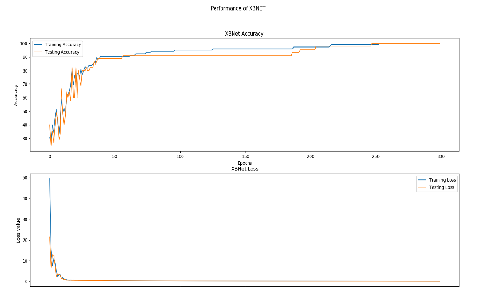

# XBNet - Xtremely Boosted Network
## Boosted neural network for tabular data

[](https://pytorch.org/ "PyTorch")
[](https://paperswithcode.com/sota/iris-classification-on-iris?p=xbnet-an-extremely-boosted-neural-network)
[](https://paperswithcode.com/sota/diabetes-prediction-on-diabetes?p=xbnet-an-extremely-boosted-neural-network)
[](https://paperswithcode.com/sota/survival-prediction-on-titanic?p=xbnet-an-extremely-boosted-neural-network)
[](https://paperswithcode.com/sota/breast-cancer-detection-on-breast-cancer-1?p=xbnet-an-extremely-boosted-neural-network)
[](https://paperswithcode.com/sota/fraud-detection-on-kaggle-credit-card-fraud?p=xbnet-an-extremely-boosted-neural-network)

XBNET that is built on PyTorch combines tree-based models with neural networks to create a robust architecture that is trained by using
a novel optimization technique, Boosted Gradient Descent for Tabular
Data which increases its interpretability and performance. Boosted Gradient Descent is initialized with the
feature importance of a gradient boosted tree, and it updates the weights of each
layer in the neural network in two steps:
- Update weights by gradient descent.
- Update weights by using feature importance of a gradient boosted tree
in every intermediate layer.

## Features

- Better performance, training stability and interpretability for tabular data.
- Easy to implement with rapid prototyping capabilities
- Minimum Code requirements for creating any neural network with or without boosting
---
### Comparison with XGBOOST
XBNET VS XGBOOST testing accuracy on different datasets with no hyperparameter tuning

| Dataset | XBNET  | XGBOOST |
| ---------------- | ---------------- | ---------------- |
| Iris  | <b>100</b>  | 97.7 |
| Breast Cancer  | <b>96.49</b>  | 96.47 |
| Wine  | <b>97.22</b>  | <b>97.22</b> |
| Diabetes  | <b>78.78</b>  | 77.48 |
| Titanic  | 79.85  | <b>80.5</b> |
| German Credit  | 71.33  | <b>77.66</b> |

---
### Installation :
```
pip install --upgrade git+https://github.com/tusharsarkar3/XBNet.git
```
---

### Example for using
```
import torch
import numpy as np
import pandas as pd
from sklearn.preprocessing import LabelEncoder
from sklearn.model_selection import train_test_split
from XBNet.training_utils import training,predict
from XBNet.models import XBNETClassifier
from XBNet.run import run_XBNET

data = pd.read_csv('test\Iris (1).csv')
print(data.shape)
x_data = data[data.columns[:-1]]
print(x_data.shape)
y_data = data[data.columns[-1]]
le = LabelEncoder()
y_data = np.array(le.fit_transform(y_data))
print(le.classes_)

X_train,X_test,y_train,y_test = train_test_split(x_data.to_numpy(),y_data,test_size = 0.3,random_state = 0)
model = XBNETClassifier(X_train,y_train,2)

criterion = torch.nn.CrossEntropyLoss()
optimizer = torch.optim.Adam(model.parameters(), lr=0.01)

m,acc, lo, val_ac, val_lo = run_XBNET(X_train,X_test,y_train,y_test,model,criterion,optimizer,32,300)
print(predict(m,x_data.to_numpy()[0,:]))
```
---
### Output images :

  

---

### Reference
If you make use of this software for your work, we would appreciate it if you would cite us:
```
@misc{sarkar2021xbnet,
      title={XBNet : An Extremely Boosted Neural Network}, 
      author={Tushar Sarkar},
      year={2021},
      eprint={2106.05239},
      archivePrefix={arXiv},
      primaryClass={cs.LG}
}
```
---
 #### Features to be added :
- Metrics for different requirements
- Addition of some other types of layers

---

<h3 align="center"><b>Developed with :heart: by <a href="https://github.com/tusharsarkar3">Tushar Sarkar</a>
